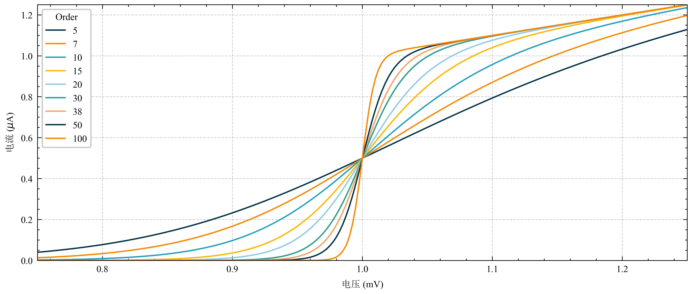

# Aqua-Fonts绘图字体

### 1. 宋体+Times New Roman字体合并

参考：[毕业论文 Matplotlib 绘图中英文设置（二）](https://www.mastermao.cn/2022/%E6%AF%95%E4%B8%9A%E8%AE%BA%E6%96%87Matplotlib%E7%BB%98%E5%9B%BE%E4%B8%AD%E8%8B%B1%E6%96%87%E8%AE%BE%E7%BD%AE%EF%BC%88%E4%BA%8C%EF%BC%89/)

合并后字体：`./sun-times.ttf`

### 2. SciencePlots样式

参考：[102B SciencePlots](https://note.mastermao.cn/%F0%9F%8D%88%20Python/0%EF%B8%8F%E2%83%A3%20%E6%89%A9%E5%B1%95%E5%BA%93/SciencePlots/)

样式：`./mastermao-simtimes.mplstyle`

示例：

